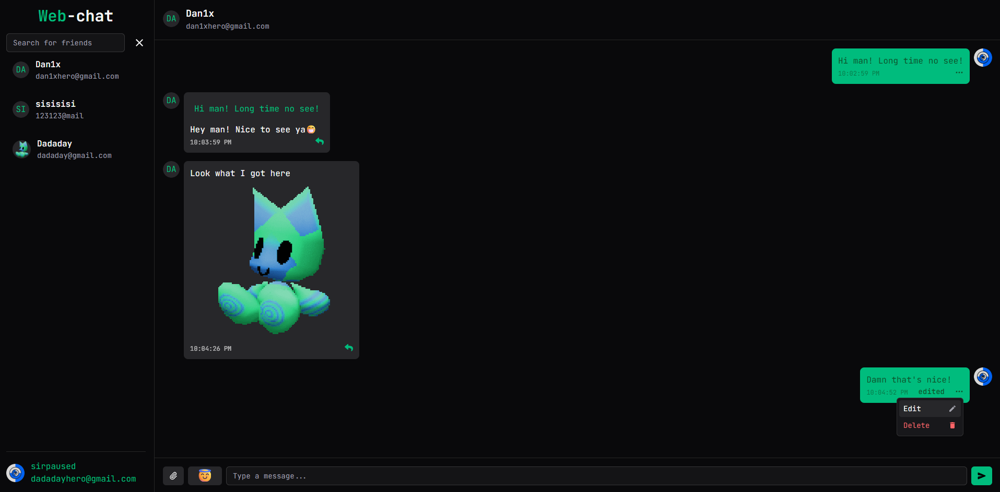
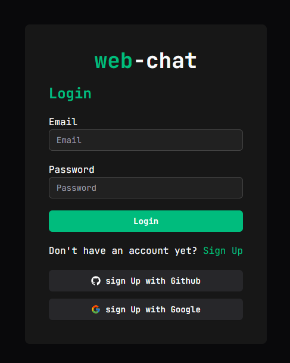
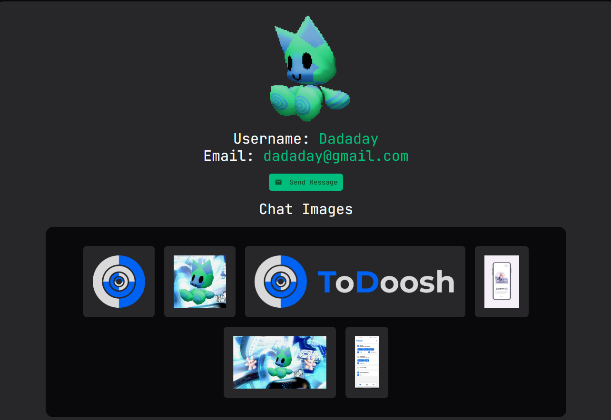
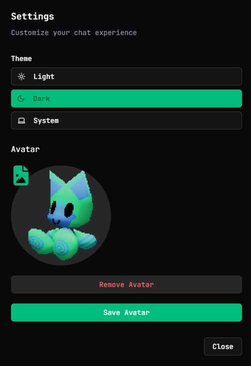

### **web-chat** - is a simple chat app, where you can talk to your friends

### Chat



### Login form



### Chat Images & User Profile



### Settings



## Functionality

- Create, delete, edit messages
- Reply on message
- Upload images
- Avatars & changing them
- Search users
- Dark theme
- Accounts

## Technologies Used

- TypeScript
- React
- shadcn
- Next.js
- Tailwind
- Supabase(auth too)

## How to Try It

1. Clone Reposiroty

   ```bash
   git clone https://github.com/Gamma101/web-chat.git
   cd web-chat
   ```

2. Install dependencies

   ```bash
   git clone
   ```

   ```bash
   npm install
   ```

3. Start the app

   ```bash
    npm run dev
   ```

4. Open [http://localhost:3000](http://localhost:3000) with your browser to see the result.
